SMART CONTACT MANAGER

Home screen

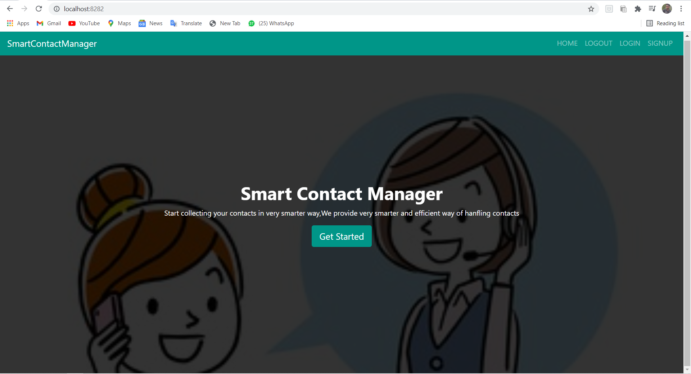

Signup Module

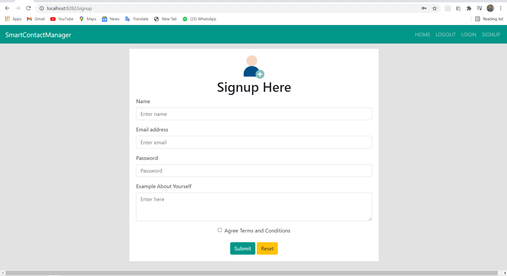

After Submitting the details

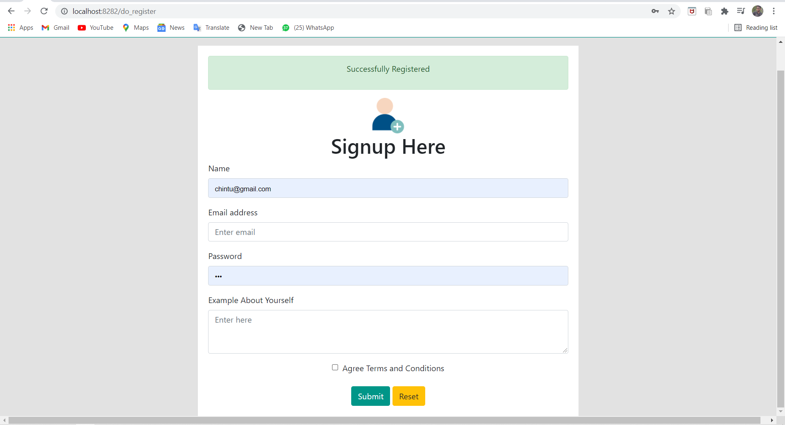

Login 

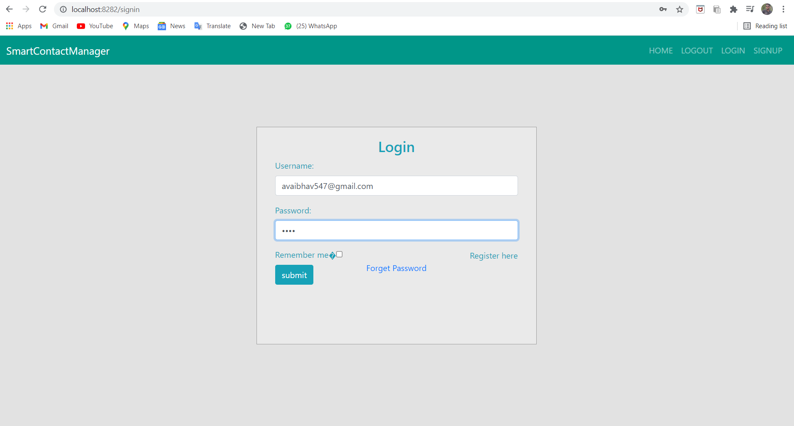

Database after signup

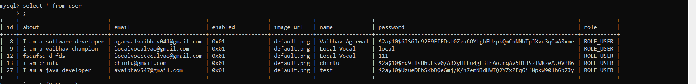

After Login

Your Profile page

Home

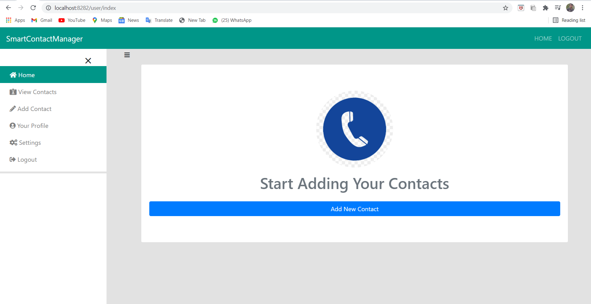

Add Contacts Page

After adding single contact

View Contacts Page

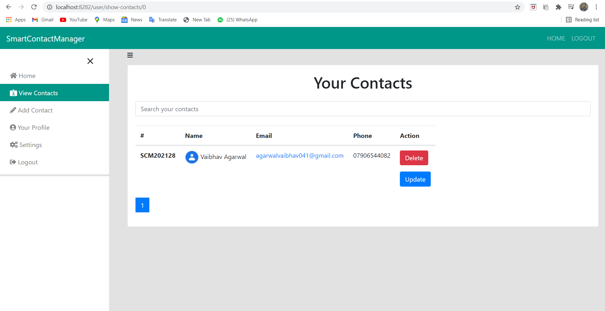

Database

Contact is mapped with user id

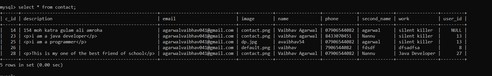

After clicking contact email 

Single contact detail page

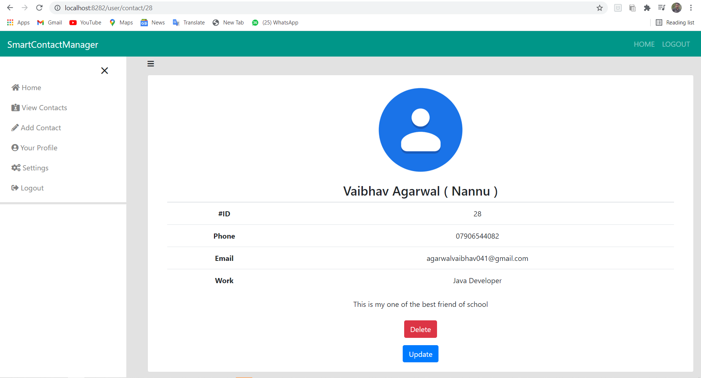

View Contacts Page with pagination after adding more than 5 contacts

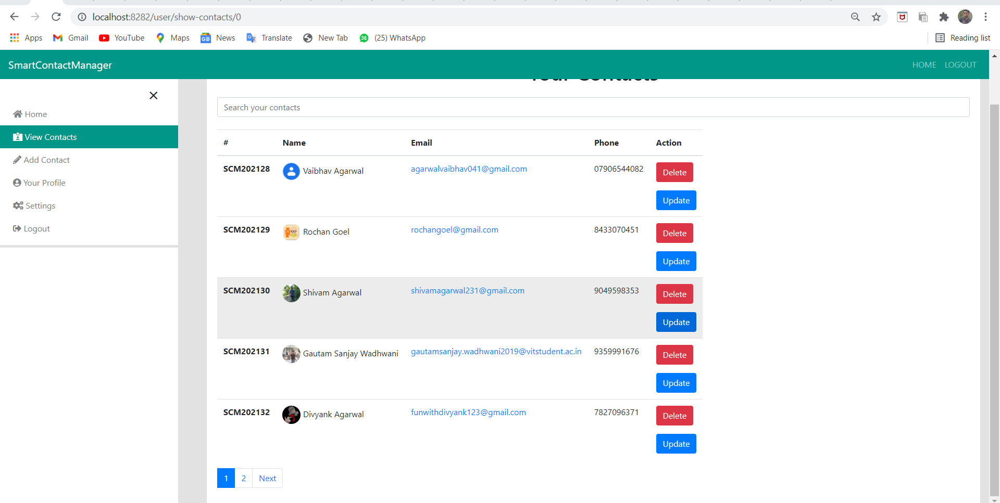 

After clicking update contact button

Here we can edit our details and save it

Afer Clicking delete contact button

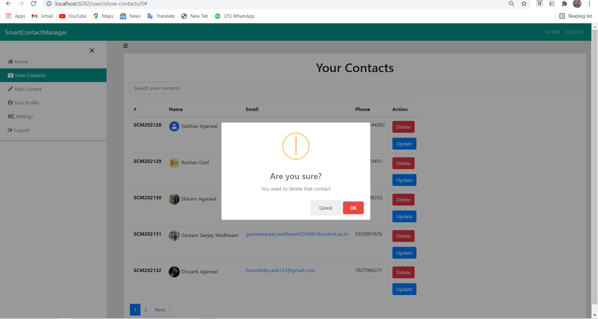

After pressing ok

After pressing cancel

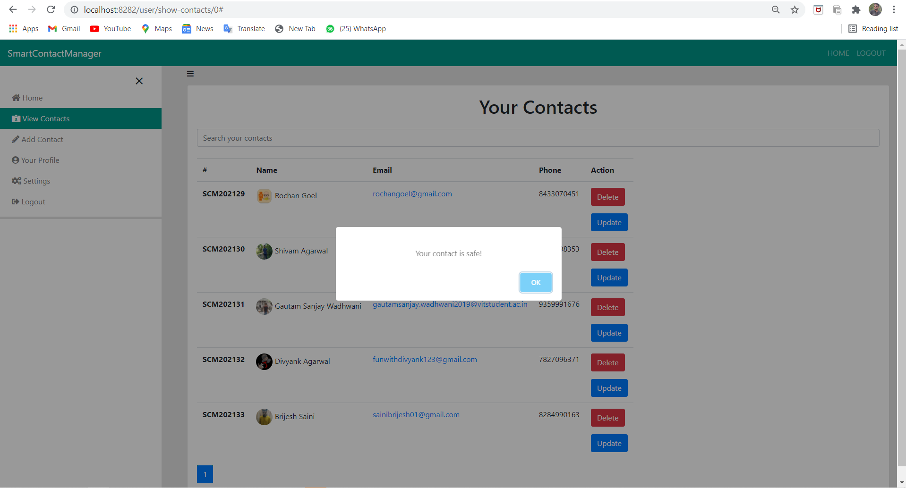

Settings Page

Here user can change his password

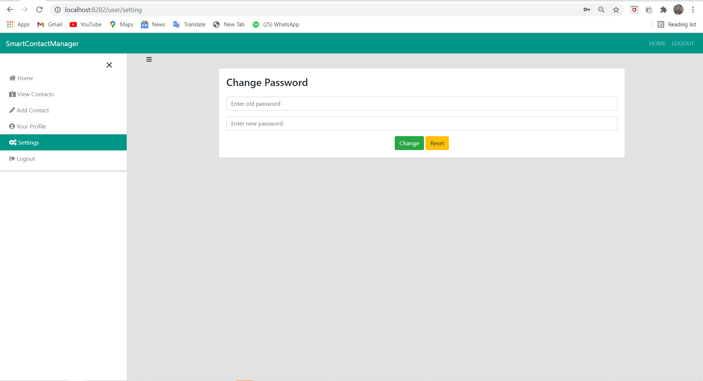

After changing password

If entering wrong password

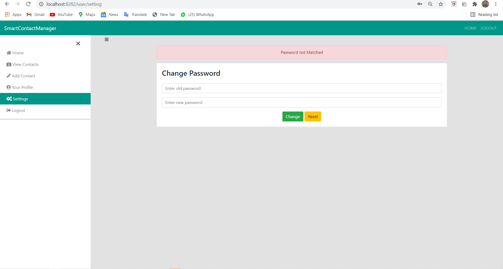

After Pressing logout

